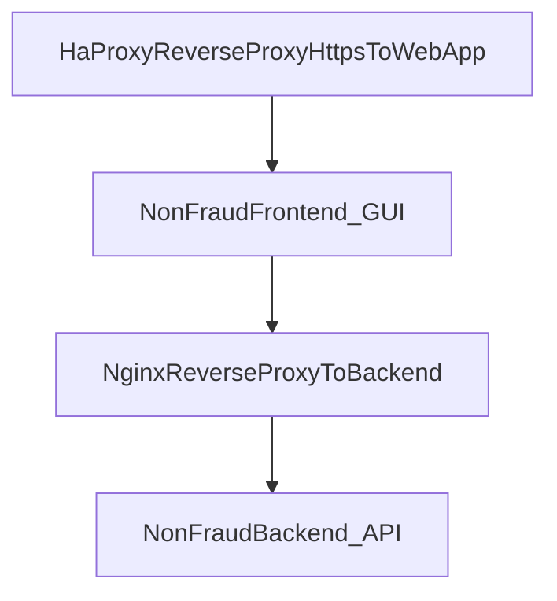

# NonFraud_Frontend

## 📘 About

NonFraud_Frontend คือ หน้าเว็บสำหรับบริหารจัดการข้อมูลผิดปกติของสนจ. และสาขา

1. เพื่อกำหนดแนวทางในการบริหารจัดการข้อมูลผิดปกติ
2. เพื่อวิเคราะห์และออกแบบระบบบริหารจัดการข้อมูลผิดปกติในการบริหารจัดการข้อมูลรายการแจ้งเตือนจากระบบงานตรวจจับการทุจริต (Fraud Detection) เฉพาะรายการแจ้งเตือนที่มีลักษณะ Non Fraud ให้กับส่วนงานที่เกี่ยวข้องรายงานผลการดำเนินงาน
3. เพื่อนำข้อมูลมาใช้ในการบริหารจัดการพฤติกรรมอันควรสงสัยโดยผลลัพธ์ในการดำเนินงานสามารถบ่งบอกถึงลักษณะของข้อมูลที่มีการกระจุกตัว การกระจายตัว และการเกิดซ้ำของรายการแจ้งเตือนในแต่ละพื้นที่ที่ดำเนินการ และเป็นแนวทางในการจัดการความเสี่ยงจากการทุจริตที่เกิดขึ้น

## 📝 Workflow


## 📦 Built With

- [x] Angular 8
- [x] TypeScript 3
- [x] Nginx

## 🥸 Project Roles

| No. |           รายชื่อ           | บทบาทหน้าที่ | ติดต่อ |
| :-: | :-------------------------: | :----------: | :----: |
|  1  |   นายศิริพงษ์ เยี่ยงยงค์    |  Developer   |  8091  |
|  2  |      นางสาวรัตนา จิโสะ      |  Developer   |  8091  |
|  3  | นายไกรสิทธิ์ เชษฐเจริญรัตน์ |  Developer   |  8092  |

## 📋 Features

- `/login` หน้าสำหรับเข้าสู่ระบบบริหารจัดการข้อมูลผิดปกติ
- `/main/page-province` หน้าแสดงภาพรวมสำหรับบริหารจัดการงานของ สนจ.
- `/main/page-province/view-alert` หน้าสำหรับดูสถานะของแต่ละรายการของ สนจ.
- `/main/page-branch` หน้าแสดงภาพรวมสำหรับบริหารจัดการงานของ สาขา
- `/main/page-branch/view-alert` หน้าสำหรับดูสถานะของแต่ละรายการของสาขา
- `/main/reports/summary-workgroup-cause` รายงานจำแนกตามระบบงานและสาเหตุ
- `/main/reports/summary-workgroup-cause-scenario` รายงานจำแนกตามเงื่อนไขการตรวจจับ (Scenario) และสาเหตุ
- `/main/reports/summary-workgroup-state` รายงานจำแนกตามระบบงาน
- `/main/reports/job-overdue` รายงานแสดงผลการปฏิบัติงานเกินกำหนด
- `/main/reports/job-complete` รายงานแสดงผลการปฏิบัติงานสำเร็จ
- `/main/reports/concentration` รายงานข้อมูลการกระจุกตัว
- `/main/reports/dispersion` รายงานข้อมูลการกระจายตัว

## ⚒ Structure



1. Server Web App: `CentOS`
   - UAT `172.26.82.38`
     - usr: root
     - pwd: password
   - PROD `172.29.26.101`

## 🖥️ Deploy

- UAT `http://172.26.82.38:51501`
- PROD `https://172.29.26.101`
- PROD DNS `https://nonfraud.int.baac.or.th`

## 🏷 Version

#### v1.6.x

- Add exportExcel DispersionReport and add imageiAuthen and footer right version
- Update jenkinsfile
- Fix bug load session isMaintenance for check state

#### v1.5.x

- Add exportExcel ConcentrationReport
- Fix bug

#### v1.4.x

- Add exportExcel jobCompleteSummaryReport and jobOverdueSummaryReport

#### v1.3.x

- Change port to 41401
- Fix bug

#### v1.2.x

- Update jenkinsfile
- Update Nginx
- Fix bug
- Update css
- Add new landingPage, add maintenancePage, update isNotChromePage, update env
- Update client max body limit
- Update text sender
- Add function getMac for by pass
- Remove getMac is not work

#### v1.1.x

- Add sonarqube
- CleanCodeSmell
- Fix bug
- Resize img login
- Update nginx proxy pass backend
- Renew environment to use standard of angular and set dev uat prod, update new pipline jenkins and docker
- Add replace file nginx and config interceptor

#### v1.0.x

- Add report JobCompleteSummary and JobCompleteDetail, edit data model, update header filter add panelViewType
- Add report JobOverdueSummary and JobOverdueDetail, edit data model, update header filter by add dynBranchName
- Update summaryStateReport by use dynBranchName from headerfilter, remove replace desc BranchName Province
- Update headerFilter load to session and add loadInitHeaderFilter Interval
- Update SummaryWorkgroupStateReport by show workgroup and subworkgroup, Fix bug headerFilter subworkgroup
- Update headerFilter by add subWorkgroupBySc and isShowPanel, Add Report SummaryWorkgroupCauseScenario
- Add lib highcharts and lodash, config highcharts to admin-layout module, update service call api for get chart and dynamic table, add component chart-dynamic-table and concentration, update header-filter for concentration
- Disable export excel of component chart-dynamic-table, update header-filter by add rdbInputConcPeriodTypeSelected_OnChange
- FilterHeader add isShow and isDisable ddlSubWorkgroupBySc, add report dispersion and dialog-dispersion-branch, update chart dynamic table case dispersion can support dialog

#### v0.10.x

- Add Remark InPageLogin For Custom Text From TBL_SYS_ConfigValue
- Add Remark 4 5 6 PageLogin
- FixBug Comp list-file-uploaded is onint load alertID emptry
- FixBug ReportJobOverdue and ReportJobComplete , issue sessionStorage in page have Injector
- Add Filter Table ReportJobOverdue and ReportJobComplete
- FixBug lsLogCommentAddByPv and lsLogCommentAddByBrn , Show CommentAddByBrn At PopAlertDetail
- Remove Package not using
- Update lastest angular 8
- Change font branch, province
- FixBug password expire is cannot cancel

#### v0.9.x

- Change Config iAuthen resetPassword Url
- Add Redirect For Register iAuthen Frist
- Delete DummyName, Add Checj IsChrome From LoginPage, Add Popup PasswordExpiar Cancel
- FixBug PopAlertDetail not building CauseTypeName, Add Link Download UserManual By Key
- Edit text WAN

#### v0.8.x

- Resize Font, Add Fn And Component JobOverdue,JobCompleteReport And Export To Excel OK , Create Share Component PopAlertDetail
- Fixbug JobCompleteReport ExportExcel, Add Clear Cache On Nginx And MetaHeader Index.html
- Test Clear Cache
- Update Report JobComplete

#### v0.7.x

- Fix Font
- Change Config
- Update Config Jenkins
- Update NginX
- Add limit file upload 25 Mb
- Enable Graud, Add GetConfigValue From DB, Edite Report Export Excel Get Process From Backend, Add Manage Header Filter Config From DB And share Component header-filter , Add comp job-complete,job-overdue
- Add Report JobOverdue And Update Config Prodution
- Add "build:Prod": "ng build --prod --output-path=dist --output-hashing=all" For Test Clear Cache New Deployment

#### v0.6.x

- Add Fn For FileUpload, FileDownload, FileRemove And Add Lib Mat-Excel-Exporter To Report
- FixBug pv brn Management Chageto AsyncFn
- FixBug ShowListReject And Comment
- Fixbug ShowListFileUpload , Update Req

#### v0.5.x

- Update Login To Page For Role
- Add fileUpload and listFileUploaded
- Update Angular To Last Version 8.3.25

#### v0.4.x

- Fix Bug, Add NavTopBar, Add BtnCommentAdd Before SendToPv Or SendToFCRM, Edit Btn Keyword, Add FlowState For Control UI

#### v0.3.x

- Add Dockerfile
- Add docker-compose
- Add jenkinsfile
- Cleansing Code

#### v0.2.x

- UI Project All

#### v0.1.x

- Initial project
- Set environments dev, sit, uat, prod
- UI Login iAuthen

## ⚙ Get Started

- 1.Clone project

  ```bash
  git clone https://ipanda.it.baac.or.th/FCRM/NonFraud_Frontend.git
  ```

- 2.Go to project folder

  ```bash
  cd NonFraud_Frontend
  ```

- 3.Set up environment by command

  ```bash
  npm install
  ```

- 4.Run project by command

  ```bash
  npm start
  ```
